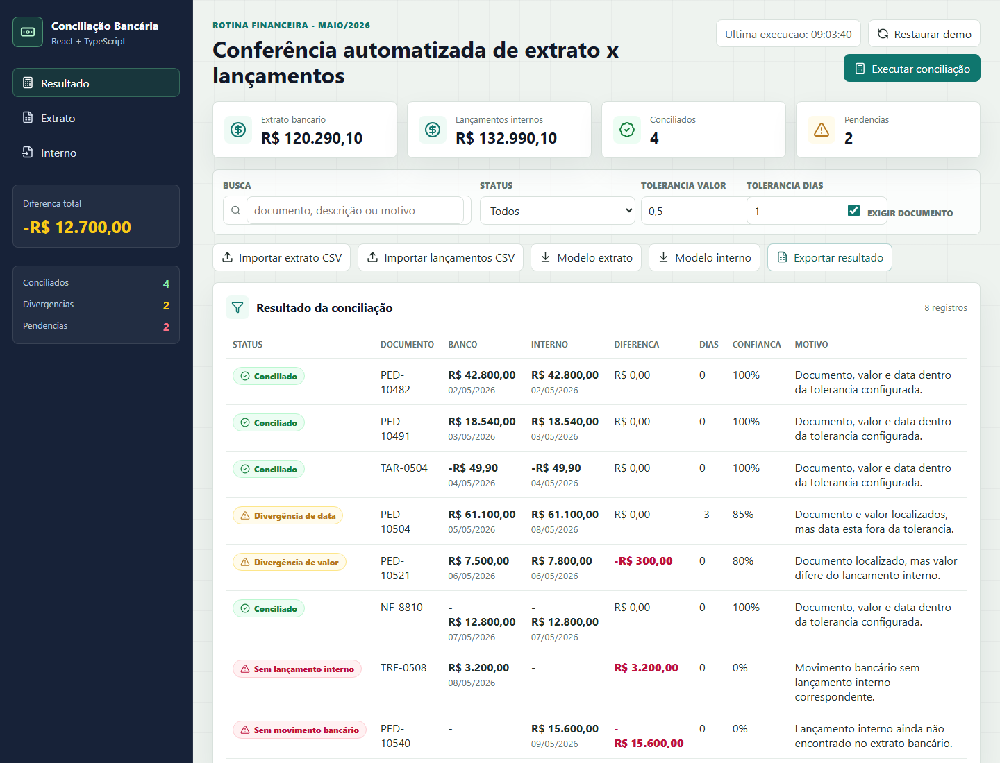

# Conciliação Bancária React + TypeScript

Aplicação web para simular uma rotina de conciliação bancária entre extrato bancário e lançamentos internos, com importação CSV, regras de comparação e classificação de divergências.

[](https://georgebarret0.github.io/conciliacao-bancaria-react-ts/)
[](#stack)



## Visão geral

Este projeto demonstra uma rotina comum em sistemas financeiros corporativos: leitura de dados, normalização, comparação por regras, identificação de divergências e apresentação operacional para revisão.

A interface foi pensada como uma mesa de trabalho: filtros, indicadores, importação, exportação e tabela de resultados em uma experiência objetiva para operação financeira.

## Funcionalidades

- Comparação entre extrato bancário e lançamentos internos.
- Classificação automática por status:
  - conciliado;
  - divergência de valor;
  - divergência de data;
  - sem lançamento interno;
  - sem movimento bancário;
  - revisão manual.
- Configuração de tolerância de valor e dias.
- Exigência opcional de correspondência por documento.
- Filtro por status e busca por documento, descrição ou motivo.
- Importação de CSV para extrato e lançamentos internos.
- Exportação do resultado conciliado em CSV.
- Layout responsivo para desktop e mobile.

## Stack

- React
- TypeScript
- Vite
- PapaParse para leitura de CSV
- Lucide React
- CSS moderno

## Como rodar

```bash
npm install
npm run dev
```

Build de produção:

```bash
npm run build
```

Preview local:

```bash
npm run preview
```

## Arquivos CSV

Modelos de CSV:

```text
public/examples/extrato-bancario.csv
public/examples/lancamentos-internos.csv
```

Formato do extrato:

```csv
id,date,description,document,amount,account,direction
bank-001,2026-05-02,PIX CLIENTE ACME PED-10482,PED-10482,42800,Banco Principal,credit
```

Formato dos lançamentos internos:

```csv
id,expectedDate,description,document,amount,costCenter,direction
entry-001,2026-05-02,Recebimento pedido PED-10482,PED-10482,42800,Comercial Recife,credit
```

## Regra de conciliação

A rotina compara registros por documento, valor, data e descrição. Quando encontra um documento correspondente, classifica o resultado conforme as tolerâncias configuradas:

- valor dentro da tolerância + data dentro da tolerância: conciliado;
- documento encontrado + valor divergente: divergência de valor;
- documento encontrado + data divergente: divergência de data;
- movimento bancário sem interno: pendente no sistema;
- interno sem banco: pendente no banco;
- combinação inconclusiva: revisão manual.

## Objetivo técnico

O foco deste projeto é mostrar domínio em:

- modelagem de regra de negócio no frontend;
- organização de tipos com TypeScript;
- parsing e normalização de CSV;
- filtros e estados de interface;
- apresentação de divergências financeiras de forma operacional.
